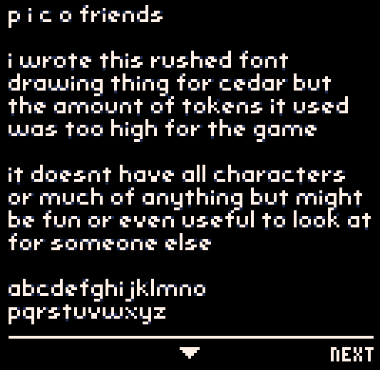

#### visit http://pico-8.com

simple, messy, basic fonts-as-sprites drawing

press the up/down arrow keys

this isn't optimized at all, an exercise for the reader
I drew the letters myself, as sprites, hence their existence in
the sprite sheet. Those are so you can swap either/or, and trade 
sprites for code space and performance
have fun!

https://underscorediscovery.ca
